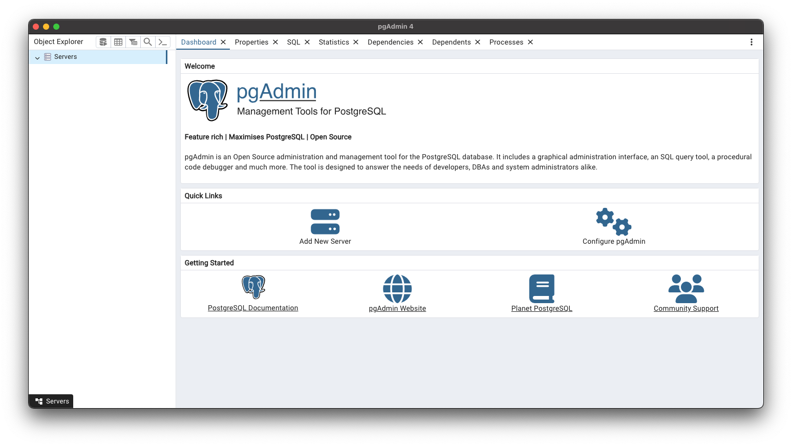
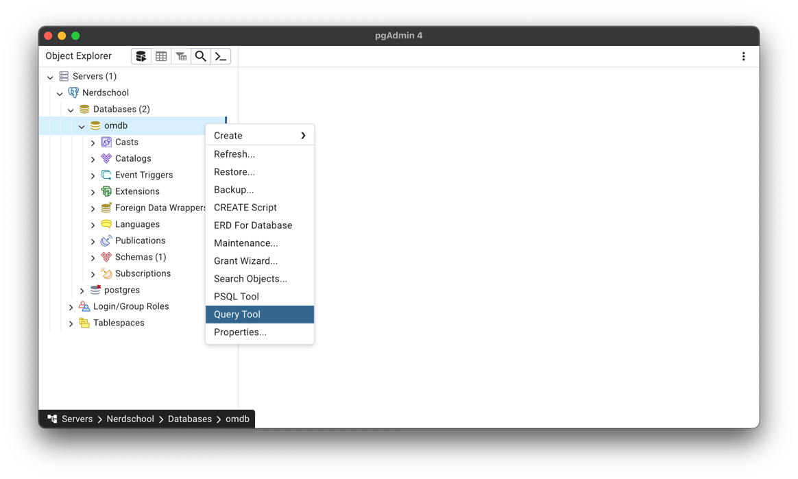
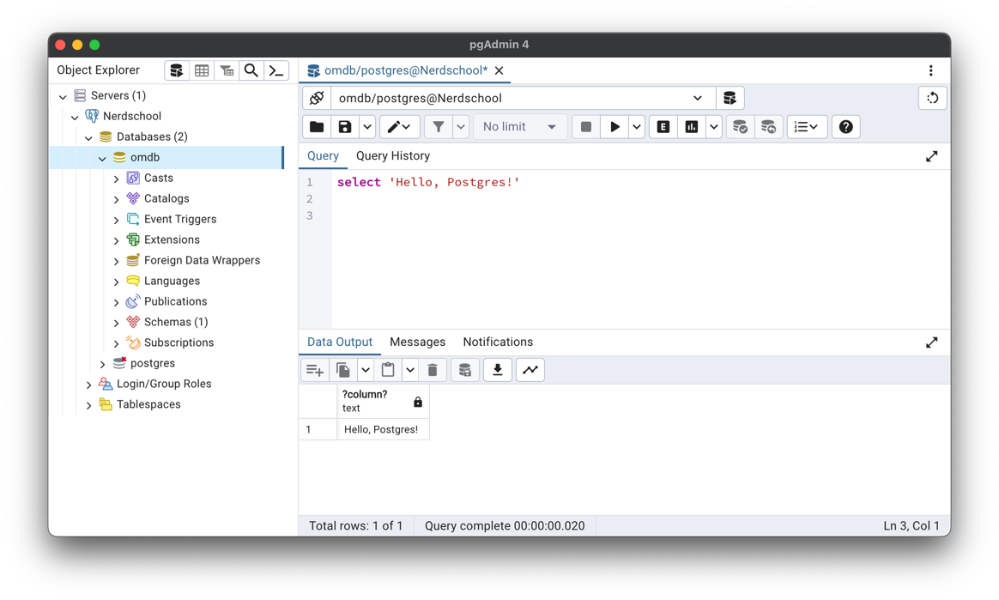
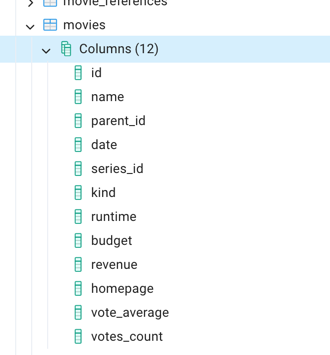

# Introduction to databases

In this workshop, we'll be working with the open source database management system called Postgres. Postgres is a server
that runs on a computer and listens for connections from clients such as our query tool or any programs we write
that need to access data in the database.

# Prerequisites

Before you start, you need to install [Docker Desktop](https://www.docker.com/products/docker-desktop/) and
[pgAdmin](https://www.pgadmin.org/).

# Starting a Postgres server

In order to start the server, we either have to install Postgres on our machine, or use a Docker image that contains
Postgres. Today, we'll use a ready-made Docker image we found on the Internet that already contains a lot of data.

To start a Postgres Docker container, run the following command:

```shell
docker run -p 5432:5432 -e POSTGRES_PASSWORD=supersecret btholt/omdb-postgres
```

This command will download the Postgres Docker image and fire up a container. The `-p` flag maps a TCP port on your
local computer to a port on the container, and the `-e` flag sets an environment variable inside the container. The last
argument is the name of the docker image we want to download and create a container from.

The output will be something like this:

``` 
Unable to find image 'btholt/omdb-postgres:latest' locally
latest: Pulling from btholt/omdb-postgres
dc1f00a5d701: Pull complete
3bb4b34c334c: Pull complete
4739db3ff30d: Pull complete
67627067cf92: Pull complete
8cb1fcaf0443: Pull complete
...
PostgreSQL init process complete; ready for start up.

+ echo 'PostgreSQL init process complete; ready for start up.'
+ echo
+ exec postgres
2024-04-20 16:41:31.933 UTC [1] LOG:  starting PostgreSQL 14.3 (Debian 14.3-1.pgdg110+1) on aarch64-unknown-linux-gnu, compiled by gcc (Debian 10.2.1-6) 10.2.1 20210110, 64-bit
2024-04-20 16:41:31.933 UTC [1] LOG:  listening on IPv4 address "0.0.0.0", port 5432
2024-04-20 16:41:31.933 UTC [1] LOG:  listening on IPv6 address "::", port 5432
2024-04-20 16:41:31.936 UTC [1] LOG:  listening on Unix socket "/var/run/postgresql/.s.PGSQL.5432"
2024-04-20 16:41:31.938 UTC [136] LOG:  database system was shut down at 2024-04-20 16:41:31 UTC
2024-04-20 16:41:31.941 UTC [1] LOG:  database system is ready to accept connections
```

Once you get to this point, you're ready to connect to the database.

# Exercise 1 - Hello Postgres

To connect to Postgres and start running queries, we need a database management tool like pgAdmin. When you first run
pgadmin, it looks something like this:



At first, pgAdmin doesn't know about the server we started up earlier, so we need to tell it. Select "Add new server",
and fill in these values:

- General > Name: `Nerdschool`
- Connection > Hostname/address: `127.0.0.1`
- Connection > Port: `5432`
- Connection > Maintenance database: `omdb`
- Connection > Username: `postgres`
- Connection > Password: `supersecret` (see environment variable `POSTGRES_PASSWORD` above)
- Connection > Save password: `yes`

Select save, and you should see the Nerdschool database in the left pane. Right click `omdb` and select `Query tool`.



On the right, you'll se a Query window where you'll write your SQL statements. Type in the following query and press F5
to run it.

```postgresql
select 'Hello, Postgres!'
```

You should get this result:



# Exercise 2 - Browsing the schema

A database server such as Postgres contains objects such as Tables (places to store data), Views (stored, named
queries) and Procedures (code that runs inside the database). These are organized in Schemas, and at the top level,
Databases.

To find the tables in this database, navigate to `Nerdschool > Databases > omdb > Schemas > public > Tables`. You should
find a list of tables with names such as `movies`, `casts` and `people`. If you expand `movies > Columns` you'll see
which columns the `movies` table contains. This is useful when writing queries.



# Exercise 3 - Your first query

In SQL, basic queries typically follow this form:

```postgresql
select [columns]
from [table]
where [condition]
```

The `select` part is a comma separated list of columns from the table you want to retrieve. To get all columns, you can
use `*` instead of the column names. The `from` part specifies which table you want to get data from. Lastly, `where` is
used to filter which rows you want to retrieve. To get all rows, simply omit the `where` part.

Task: Write a query that returns all rows and columns in the `movies` table. Browse the results and familiarize yourself
with the contents of the table. 


