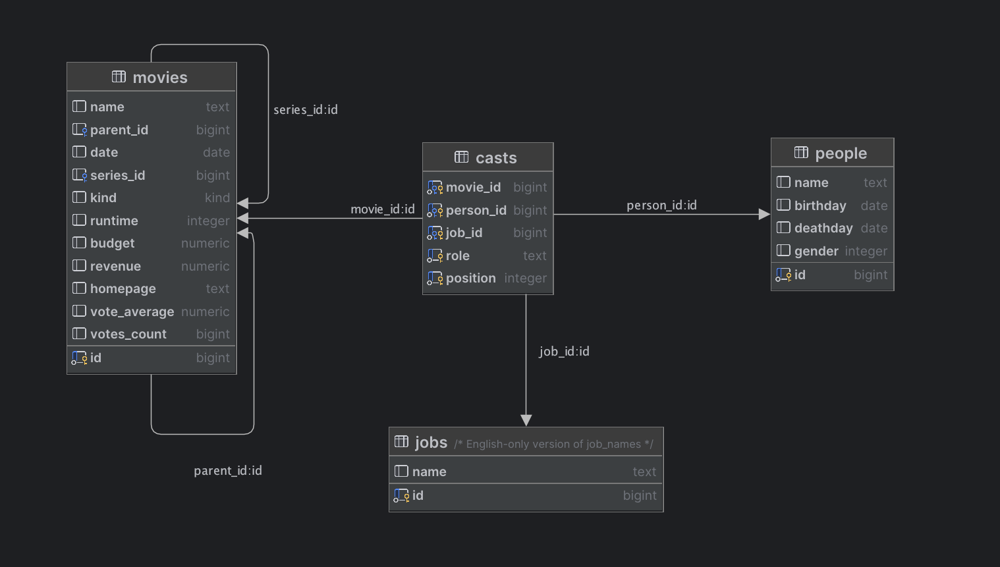

# Introduction to databases

In this workshop, we'll be working with the open source database management system called Postgres. Postgres is a server
that runs on a computer and listens for connections from clients such as our query tool or any programs we write
that need to access data in the database.

# Prerequisites

Before you start, you need to install [Docker Desktop](https://www.docker.com/products/docker-desktop/) and
[pgAdmin](https://www.pgadmin.org/).

# Starting a Postgres server

In order to start the server, we either have to install Postgres on our machine, or use a Docker image that contains
Postgres. Today, we'll use a ready-made Docker image we found on the Internet that already contains a lot of data.

To start a Postgres Docker container, run the following command:

```shell
docker run -p 5432:5432 -e POSTGRES_PASSWORD=supersecret btholt/omdb-postgres
```

This command will download the Postgres Docker image and fire up a container. The `-p` flag maps a TCP port on your
local computer to a port on the container, and the `-e` flag sets an environment variable inside the container. The last
argument is the name of the docker image we want to download and create a container from.

The output will be something like this:

``` 
Unable to find image 'btholt/omdb-postgres:latest' locally
latest: Pulling from btholt/omdb-postgres
dc1f00a5d701: Pull complete
3bb4b34c334c: Pull complete
4739db3ff30d: Pull complete
67627067cf92: Pull complete
8cb1fcaf0443: Pull complete
...
PostgreSQL init process complete; ready for start up.

+ echo 'PostgreSQL init process complete; ready for start up.'
+ echo
+ exec postgres
2024-04-20 16:41:31.933 UTC [1] LOG:  starting PostgreSQL 14.3 (Debian 14.3-1.pgdg110+1) on aarch64-unknown-linux-gnu, compiled by gcc (Debian 10.2.1-6) 10.2.1 20210110, 64-bit
2024-04-20 16:41:31.933 UTC [1] LOG:  listening on IPv4 address "0.0.0.0", port 5432
2024-04-20 16:41:31.933 UTC [1] LOG:  listening on IPv6 address "::", port 5432
2024-04-20 16:41:31.936 UTC [1] LOG:  listening on Unix socket "/var/run/postgresql/.s.PGSQL.5432"
2024-04-20 16:41:31.938 UTC [136] LOG:  database system was shut down at 2024-04-20 16:41:31 UTC
2024-04-20 16:41:31.941 UTC [1] LOG:  database system is ready to accept connections
```

Once you get to this point, you're ready to connect to the database.

# Exercise 1 - Hello Postgres

To connect to Postgres and start running queries, we need a database management tool like pgAdmin. When you first run
pgadmin, it looks something like this:


At first, pgAdmin doesn't know about the server we started up earlier, so we need to tell it. Select "Add new server",
and fill in these values:

- General > Name: `Nerdschool`
- Connection > Hostname/address: `127.0.0.1`
- Connection > Port: `5432`
- Connection > Maintenance database: `omdb`
- Connection > Username: `postgres`
- Connection > Password: `supersecret` (see environment variable `POSTGRES_PASSWORD` above)
- Connection > Save password: `yes`

Select save, and you should see the Nerdschool database in the left pane. Right click `omdb` and select `Query tool`.


On the right, you'll se a Query window where you'll write your SQL statements. Type in the following query and press F5
to run it.

```postgresql
SELECT 'Hello, Postgres!';
```

You should get this result:


# Exercise 2 - Browsing the schema

A database server such as Postgres contains objects such as Tables (places to store data), Views (stored, named
queries) and Procedures (code that runs inside the database). These are organized in Schemas, and at the top level,
Databases.

To find the tables in this database, navigate to `Nerdschool > Databases > omdb > Schemas > public > Tables`. You should
find a list of tables with names such as `movies`, `casts` and `people`. If you expand `movies > Columns` you'll see
which columns the `movies` table contains. This is useful when writing queries.


# Exercise 3 - Your first query

In SQL, basic queries follow this form:

```postgresql
SELECT [columns]
FROM [table]
WHERE [condition];
```

The `select` part is a comma separated list of columns from the table you want to retrieve. To get all columns, you can
use `*` instead of the column names. The `from` part specifies which table you want to get data from. Lastly, `where` is
used to filter which rows you want to retrieve. To get all rows, simply omit the `where` part.

:pencil2: Write a query that returns all rows and columns in the `movies` table. Browse the results and familiarize yourself
with the contents of the table.

# Exercise 4 - Selecting specific columns using `SELECT`

Tables typically contain a lot of columns. If you only want to display a few of them in your app, it is wasteful to
select all the columns. It also adds to the time it takes to transfer the data from the database server to your app.

:pencil2: Write a query that retrieves the name, date and kind of movies. Browse through the results and look at the
different kinds.

# Exercise 5 - Filtering results using `WHERE`

It turns out the `movies` table contains not only movies, but also the names of series and their seasons, episodes of
those series and even series of movies like "Home alone" 1, 2 and 3.

:pencil2: Write a query that retrieves all series.

[Tutorial: The WHERE statement](https://www.postgresqltutorial.com/postgresql-tutorial/postgresql-where/)

# Exercise 6 - Inserting data with `INSERT`

Retrieving data is fine, but how do you get the data into the database in the first place? That's where the `INSERT` 
statement comes into play. The statement has the following syntax: 

```postgresql
INSERT INTO car(license_plate, model) 
VALUES('AB 12345', 'Toyota Avensis');
```

:pencil2: Insert your name into the `people` table. Make sure you select an `id` that's not already taken. Note that 
dates have to be entered in `yyyy-mm-dd` format.


# Exercise 7 - Updating data with `UPDATE`

If you want to change a row that's already in the database, you need to use the `UPDATE` statement. The update statement
has the following syntax:

```postgresql
UPDATE car 
    SET model = 'Nissan Leaf'
WHERE license_plate = 'AB 12345';
```

The `WHERE` part is very important. If you leave it out, the database will happily change every single row in the table. 

:pencil2: Try to change your name in the `people` table using the `id` you provided in the `WHERE` part. 

# Exercise 8 - Deleting rows with `DELETE`

To remove data from the database, you use the `DELETE` statement. The statement has the following syntax:  

```postgresql
DELETE FROM car
WHERE license_plate = 'AB 12345';
```

:pencil2: Delete yourself from the `people` table.

# Exercise 9 - Substring matching with `LIKE`

There seems to be a lot of different Star Trek series, with different names such as 'Star Trek: The Next Generation'
and 'Star Trek: Deep Space Nine'. To find all series that have the words 'Star Trek' in them, you can use the `LIKE`
operator instead of the equals sign. This allows you to use wildcards in your queries. To match any sequence of
characters, use the `%` sign, like this:

```postgresql
SELECT *
FROM foo
WHERE bar LIKE '%baz%';
```

Note that like is case sensitive. If you want to match text case insensitively, first convert the column to lower case
like this:

```postgresql
SELECT *
FROM foo
WHERE lower(bar) LIKE '%baz%';
```

The conversion is done during query execution, and does not affect the stored data in the table.

:pencil2: Find all the different Star Trek series.

[Tutorial: The LIKE operator](https://www.postgresqltutorial.com/postgresql-tutorial/postgresql-like/)

# Exercise 10 - Sorting data using `ORDER BY`

You may have noticed that the rows are returned in a seemingly random order. This is because we haven't specified which
order we want them in, and Postgres simply returns them as it stumbles upon them. If you want the data in a particular
order, you must use the `ORDER BY` statement. It has the following syntax:

```postgresql
SELECT *
FROM foo
ORDER BY bar ASC;
```

The `ASC` part tells postgres that we want the results ordered by the value of the `bar` column in ascending order,
which by the way is the default. If we want them in descending order instead, use `DESC`.

:pencil2: Sort the Star Trek series by date, first in ascending then in descending order.

# Exercise 11 - Joining tables

To avoid duplicating data, the name and birthday of actors and other cast is stored once in a table called `people`,
and each time they appear in a movie, their id is linked to the movie in a table called `casts`. This avoids having
to repeat the name and birthday of each person for every movie they appear in.

If we want to find all the movies Patric Stuart has appeared in, we need to join the `casts` table with both
the `movies` table and the `people` table. This is how they are connected:



As we can see, each row in the `casts` table contains the `movie_id` and the `person_id` of the movies and people
involved. Since more than one person is involved in the making of one movie, there are several rows in `casts` that have
the same `movie_id`. Since a person may appear in several movies, there are also several rows in `casts` that have
the same `person_id`.

The arrows in the diagram point from the table that uses a key to the table that owns the key. When the `casts` table
refers to a `movie`, it does so by creating a column called `movie_id` that points to the `id` of a specific `movie`.
You can think of it as "One cast refers to one movie", and inversely, "One movie can be referred to by several casts".
If we want to get a list of movie names and person names, we need to `JOIN` these tables using their id columns.

In order not to reveal the answer to the task right away, imagine that a person may own several cars. The syntax for
joining these two tables looks like this:

```postgresql
SELECT p.name, c.license_plate
FROM person p
         INNER JOIN car c ON c.owner_person_id = p.id;
```

There are a couple of new concepts going on here. First, notice that we have given the table `person` an alias `p`. This
is because it's shorter when we want to select the `name` of the `person` table, and when we use columns from
the `person`
table in the `JOIN` with `car`.

The `INNER JOIN` part is where we tell Postgres how we want to connect the tables. In the example, if the
`owner_person_id` column in a `car` row points to a the `id` column of a `person` row, we need to say that we want rows
where these two ids are the same. That's what the `ON c.owner_person_id = p.id` means. If we didn't do that, we would
get all `car` rows matched with every `person` row, regardless of who owns which car. As a rule, this is not what we
want.

:pencil2: Write a query that finds all the people involved in the movie 'Star Trek Into Darkness'.

[Tutorial: INNER JOIN](https://www.postgresqltutorial.com/postgresql-tutorial/postgresql-inner-join/)

# Task 12 - Putting it all together

The last task is to find the name and date of all movies where Patrick Stuart was an actor, ordered by the release date.


