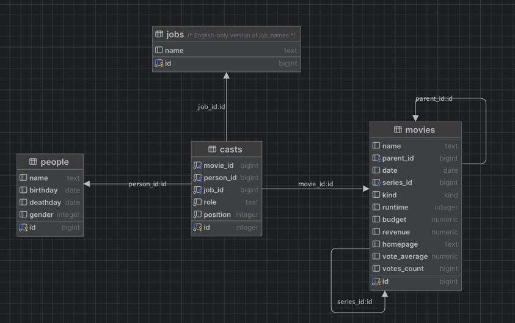

# Java Persistence API

In this workshop, we'll be working with the open source database management system called Postgres. Postgres is a server
that runs on a computer and listens for connections from clients such as our query tool or any programs we write
that need to access data in the database.

# Prerequisites

Before you start, you need to install [Docker Desktop](https://www.docker.com/products/docker-desktop/) and [maven](https://maven.apache.org). Then, clone the 
git repository to a directory on your own computer. Start a terminal and navigate to this directory.

# Starting a Postgres server

In order to start the server, we either have to install Postgres on our machine, or use a Docker image that contains
Postgres. Today, we'll use a ready-made Docker image we found on the Internet that already contains a lot of data.

To start a Postgres Docker container, run the following command:

```shell
docker compose up
```

This command will download and start a container with our postgres database and a container with pgAdmin.

The output will be something like this:

``` 
Unable to find image 'btholt/omdb-postgres:latest' locally
latest: Pulling from btholt/omdb-postgres
dc1f00a5d701: Pull complete
3bb4b34c334c: Pull complete
4739db3ff30d: Pull complete
67627067cf92: Pull complete
8cb1fcaf0443: Pull complete
...
PostgreSQL init process complete; ready for start up.

+ echo 'PostgreSQL init process complete; ready for start up.'
+ echo
+ exec postgres
2025-03-04 16:05:35.278 UTC [1] LOG:  starting PostgreSQL 14.3 (Debian 14.3-1.pgdg110+1) on aarch64-unknown-linux-gnu, compiled by gcc (Debian 10.2.1-6) 10.2.1 20210110, 64-bit
2025-03-04 16:05:35.278 UTC [1] LOG:  listening on IPv4 address "0.0.0.0", port 5432
2025-03-04 16:05:35.278 UTC [1] LOG:  listening on IPv6 address "::", port 5432
2025-03-04 16:05:35.280 UTC [1] LOG:  listening on Unix socket "/var/run/postgresql/.s.PGSQL.5432"
2025-03-04 16:05:35.282 UTC [165] LOG:  database system was shut down at 2025-03-04 16:05:35 UTC
2025-03-04 16:05:35.284 UTC [1] LOG:  database system is ready to accept connections
----------
Loading servers with:
User: pgadmin4@pgadmin.org
SQLite pgAdmin config: /var/lib/pgadmin/pgadmin4.db
----------
Added 0 Server Group(s) and 1 Server(s).
postfix/postlog: starting the Postfix mail system
[2025-03-04 16:05:40 +0000] [1] [INFO] Starting gunicorn 22.0.0
[2025-03-04 16:05:40 +0000] [1] [INFO] Listening at: http://[::]:80 (1)
[2025-03-04 16:05:40 +0000] [1] [INFO] Using worker: gthread
[2025-03-04 16:05:40 +0000] [133] [INFO] Booting worker with pid: 133
```

Once you get to this point, you're ready to connect to the database.

# Exercise 1 - Hello Postgres

To connect to Postgres and start running queries, we have provided a database management tool called pgAdmin.
It's running on your computer at http://localhost:7777


Select save, and you should see the Nerdschool database in the left pane. Right click `omdb` and select `Query tool`.


On the right, you'll se a Query window where you'll write your SQL statements. Type in the following query and press F5
to run it.

```postgresql
SELECT 'Hello, Postgres!';
```

You should get this result:


## Using another query tool
If you want to use another query tool, for instance the one provided in IntelliJ, these are the connection properties:

- Hostname/address: `127.0.0.1`
- Port: `5432`
- Authentication: Username/password
- Database: `omdb`
- Username: `postgres`
- Password: `supersecret`
- URL: jdbc:postgresql://localhost:5432/omdb?user=postgres&password=supersecret

# Exercise 2 - Browsing the schema

A database server such as Postgres contains objects such as Tables (places to store data), Views (stored, named
queries) and Procedures (code that runs inside the database). These are organized in Schemas, and at the top level,
Databases.

To find the tables in this database, navigate to `Nerdschool > Databases > omdb > Schemas > public > Tables`. You should
find a list of tables with names such as `movies`, `casts` and `people`. If you expand `movies > Columns` you'll see
which columns the `movies` table contains. This is useful when writing queries.


To get started, you first need to clone the git repository to your local computer. The commands below assume that 
you have started a terminal and navigated to the directory where the git repository is checked out. 

# Running the project
To run the project: 

```shell
mvn clean spring-boot:run 
```

After you've made changes, you must restart the project. If you use IntelliJ, simply rebuilding the project 
(Build -> Build Project) will trigger an automatic reload. 

# Exercise 1 - List all the Star Wars movies

If you visit http://localhost:8080 you should see a list of movies released in march 1999. This list is generated
by the `MovieController` class, which in turn uses `MovieRepository` to query the database.

:pencil2: Change the method `MovieRepository.findMovies()` so that it returns all the Star Wars movies.

<details>
<summary>Hint</summary>

You can use
the `LIKE` keyword and the `%` wildcard to match parts of a string. Note that `LIKE` is case sensitive. There
is a Postgres specific keyword called `ILIKE` which does a case-insensitive comparison. This is not part of the
SQL standard, so it is not supported by all databases. The standard approach is to use
`lower (m.name) LIKE %something%`
</details>

# Exercise 2 - Link to homepage

In the `movies` table, you'll find a column called `homepage`, but there is no corresponding field in
the `Movie` java class.

:pencil2: Add a `homepage` field to the `Movie` java class and display a link to the homepage of the movie
in `movie-list.jsp`. Note: not all movies have a homepage.

# Exercise 3 - Link to movie details

We want to be able to click on a movie in the list and display more details about that movie. There should be
a separate page for movie details, and that page needs its own URL. It is common practice to use the id (or
other unique property) of the database row to create a unique URL. The URL for the movies page is
http://localhost:8080/movies, so it would be natural to use http://localhost:8080/movies/11 for a movie with
id = 11.

:pencil2: Create a link to the details page for each movie in `movie-list.jsp`. Then, in `MoviesController.show()`,
use the `id` parameter to look up the correct movie from the `MovieRepository` and pass it along to the
`ModelAndView`.

<details>
<summary>
Hint: 
</summary>

The syntax for linking to a page on the same host is `<a href="/movies/${movie.id}">${movie.name}</a>`
</details>

# Exercise 4 - Show the cast of a movie

There are lots of people involved in making a movie, and each person can be involved in several different movies,
doing different jobs. This is represented by the `casts` table in the database, by connecting a person, a movie and a
job.



When looking at one particular movie in the database, you can follow the relationship between the `movies` and the
`casts` table to find all the people involved in that movie. This is a One-to-Many relationship, since one movie
can have many casts, while one particular row in the `casts` table refers to only one movie. In JPA, this is described
with the `@OneToMany` annotation.

Example: A relationship between cars and their owners

```java

@Entity
class Person {
  @Id
  Long id;
  
  @OneToMany(mappedBy = "owner") //refers to the java property name "owner" in the Car class
  List<Car> cars;
}

class Car {
  @Id
  Long id;
  
  @ManyToOne
  @JoinColumn("owner_person_id") //refers to the database column "owner_person_id" in the table "car"
  Person owner;
}
```

In this example, one `Person` can own many `Cars`, so this is a `@OneToMany` relationship as seen from the `Person`
side of the relationship. On the other hand, one `Car` can only have a single `Person` as its owner, so this is a
`@ManyToOne` relationship.

:pencil2: Use the `@ManyToOne` and `@OneToMany` annotations to connect the `Movie` and `Cast` classes, the
`Person` and `Cast` classes and the `Job` and `Cast` classes. Try out the movie detail page and you should see the
cast of the movie.

<details>
<summary>Hint:</summary>

In this database, the relationship between movie and casts is a one-to-many relationship. One movie is related to several casts.
And inversely the relation between casts and movie is a many-to-one relation.

Casts also have a many-to-one relation to job and person

</details>

# Exercise 4 - Show the director

You should now have a property `List<Cast> casts` in the `Movie` class. One of the cast in that list has a `Job`
with the name `"Director"`.

:pencil2: Implement the `getDirector()` method in `Movie` so that it returns the `Person` who was the director.
Then, display the name of that person in the `movies-list` page in the "Director" column.

Now that you have the director of a movie, you can create a link to a page that shows more details about that person.
The URL should be http://localhost:8080/directors/1 for a person with id=1.

:pencil2: Add a link to the detail page of a director on the `movies-list` page.

# Exercise 5 - Show a list of movies a person has directed

You can navigate the `casts` relationship the other way, too. In `Person` there is a method called
`getMoviesDirected()`.

:pencil2: Implement the `Person.getMoviesDirected()` method by iterating through person's `casts` list and returning a
list of movies where the person was the director. Then, display the list of movies on the director's detail page.

# Exercise 6 - Show a list of directors

You've tried iterating through a list of cast to find directors, but in order to find all directors in this
manner, you would have to iterate through all people (or all movies) and looking at all their cast. This is a
task better left to the database.

In the `PersonRespository`, there is a method called `findAllDirectors()`, which has as SQL query.

:pencil2: Modify this query so that it joins the `people`, `casts` and `jobs` tables and returns only
the people who have directed at least one movie. This is a long list, so be sure to add `limit 100` to 
avoid fetching a lot of rows!

