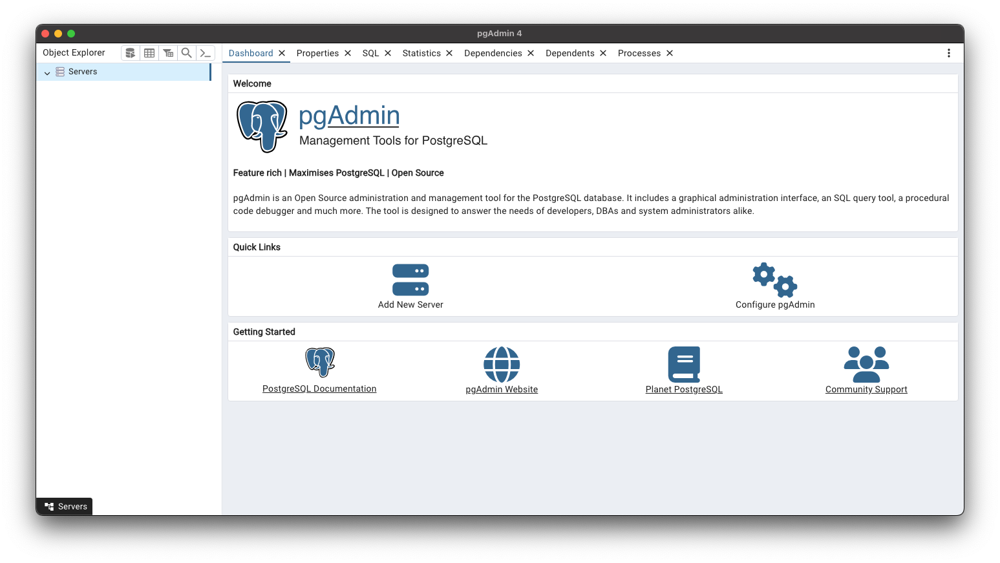
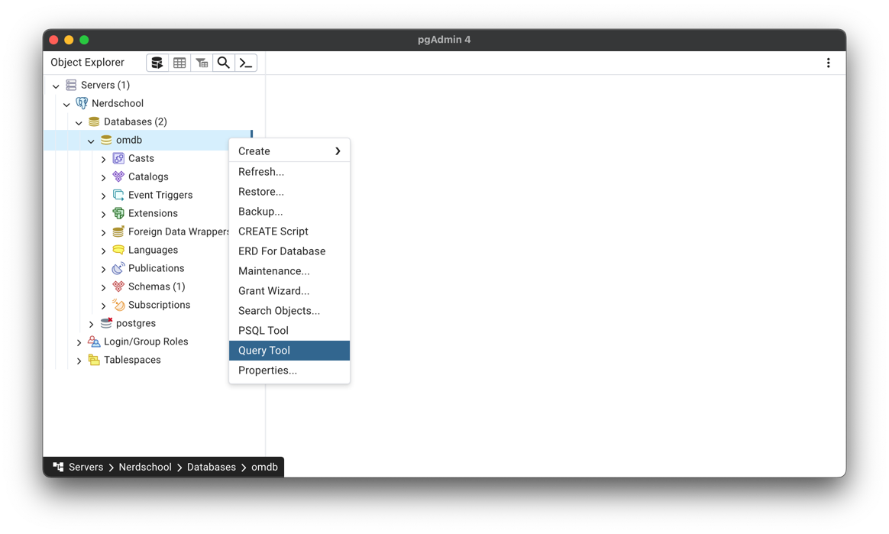
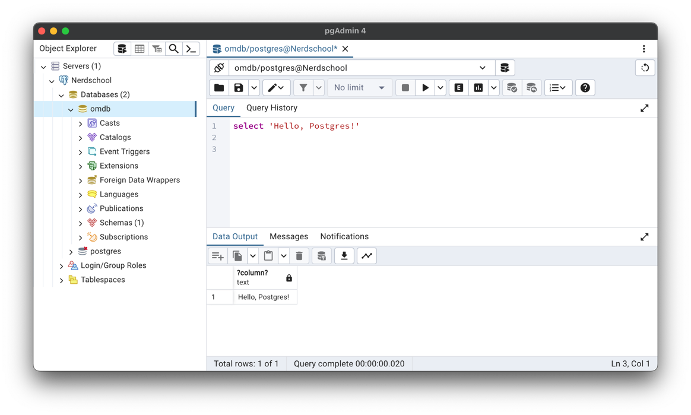
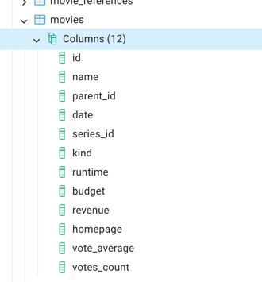

# Exercise 1 - Getting Started

In this exercise, we'll start a PostgreSQL database server using Docker, connect to it using pgAdmin, and explore the database schema.

You will learn to:

- Start a PostgreSQL server using Docker Compose
- Connect to a database using pgAdmin
- Run your first SQL query
- Navigate database schemas, tables, and columns

## Before you begin

> **Before you begin**: Please make sure that you have the following installed:

- IntelliJ Community Edition: [IntelliJ Community Edition](https://www.jetbrains.com/idea/download/)
- JDK Development Kit (JDK 17 or later): [Java SE Development Kit](https://www.oracle.com/java/technologies/downloads/)
- Alternative dev kit (Java 17 or later): [Eclipse Temurin Java Development Kit](https://adoptium.net/)

1. :pencil2: Start by cloning this repository into a folder on your computer. If you've never used git before, you can alternatively use the the green "Code" button to the top right, and then select "Download zip". Unzip the downloaded zip file (make sure to remember where you put it).
2. :pencil2: Start IntelliJ and go `File -> Open -> select the POM.xml file in the 'alarmsystem' folder in the repository`. If IntelliJ asks, you want to select `Yes` for "Open as Project?" and "Keep existing project" for the second prompt. (See [IntelliJ docs](https://www.jetbrains.com/help/idea/maven-support.html#maven_import_project_start))
3. If IntelliJ prompts you to "Trust and Open Project", select `Trust Project` (See [IntelliJ Project Security](https://www.jetbrains.com/help/idea/project-security.html))
4. :pencil2: You should be able to compile the code and run it.

## 1.1 Starting a Postgres server

:book: In order to start the server, we'll use a ready-made Docker image that already contains a lot of data. The `docker-compose.yaml` in this repository defines two containers: a Postgres database and pgAdmin (a database management tool).

:pencil2: Open a terminal, navigate to the repository directory, and run:

```shell
docker compose up
```

:book: This command will download and start a container with our Postgres database and a container with pgAdmin. The output will be something like this:

```
Unable to find image 'btholt/omdb-postgres:latest' locally
latest: Pulling from btholt/omdb-postgres
dc1f00a5d701: Pull complete
3bb4b34c334c: Pull complete
...
PostgreSQL init process complete; ready for start up.
2025-03-04 16:05:35.284 UTC [1] LOG:  database system is ready to accept connections
```

> :exclamation: Wait until you see `database system is ready to accept connections` before proceeding.

## 1.2 Hello Postgres

:pencil2: Open pgAdmin in your browser at http://localhost:7777



:pencil2: Select save, and you should see the Nerdschool database in the left pane. Right click `omdb` and select `Query tool`.



:book: On the right, you'll see a Query window where you'll write your SQL statements.

:pencil2: Type in the following query and press <kbd>F5</kbd> to run it:

```postgresql
SELECT 'Hello, Postgres!';
```

You should get this result:



## 1.3 Using another query tool

:bulb: If you want to use another query tool, for instance the one provided in IntelliJ, these are the connection properties:

- Hostname/address: `127.0.0.1`
- Port: `5432`
- Authentication: Username/password
- Database: `omdb`
- Username: `postgres`
- Password: `supersecret`
- URL: `jdbc:postgresql://localhost:5432/omdb?user=postgres&password=supersecret`

## 1.4 Browsing the schema

:book: A database server such as Postgres contains objects such as Tables (places to store data), Views (stored, named queries) and Procedures (code that runs inside the database). These are organized in Schemas, and at the top level, Databases.

:pencil2: To find the tables in this database, navigate to `Nerdschool > Databases > omdb > Schemas > public > Tables`. You should find a list of tables with names such as `movies`, `casts` and `people`.

:pencil2: Expand `movies > Columns` to see which columns the `movies` table contains. This is useful when writing queries.



### [Go to exercise 2 :arrow_right:](../exercise-2/README.md)
