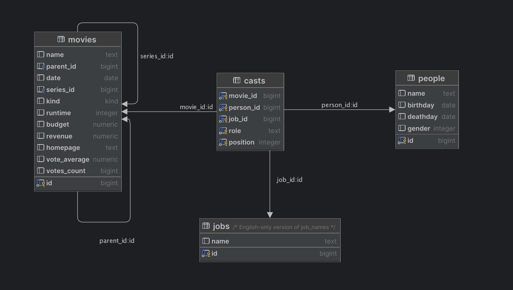

# Exercise 5 - Joining Tables

In this exercise, we'll learn how to combine data from multiple tables using `JOIN`, which is one of the most powerful features of relational databases.

You will learn to:

- Understand relationships between tables using foreign keys
- Use `INNER JOIN` to combine related data from multiple tables
- Write queries that span several tables

## 5.1 Joining tables

:book: To avoid duplicating data, the name and birthday of actors and other cast is stored once in a table called `people`, and each time they appear in a movie, their id is linked to the movie in a table called `casts`. This avoids having to repeat the name and birthday of each person for every movie they appear in.

If we want to find all the movies Patrick Stewart has appeared in, we need to join the `casts` table with both the `movies` table and the `people` table. This is how they are connected:



:book: Each row in the `casts` table contains the `movie_id` and the `person_id` of the movies and people involved. Since more than one person is involved in the making of one movie, there are several rows in `casts` that have the same `movie_id`. Since a person may appear in several movies, there are also several rows in `casts` that have the same `person_id`.

The arrows in the diagram point from the table that uses a key to the table that owns the key. When the `casts` table refers to a `movie`, it does so by creating a column called `movie_id` that points to the `id` of a specific `movie`. You can think of it as "One cast refers to one movie", and inversely, "One movie can be referred to by several casts".

If we want to get a list of movie names and person names, we need to `JOIN` these tables using their id columns.

:book: In order not to reveal the answer to the task right away, imagine that a person may own several cars. The syntax for joining these two tables looks like this:

```postgresql
SELECT p.name, c.license_plate
FROM person p
         INNER JOIN car c ON c.owner_person_id = p.id;
```

There are a couple of new concepts going on here. First, notice that we have given the table `person` an alias `p`. This is because it's shorter when we want to select the `name` of the `person` table, and when we use columns from the `person` table in the `JOIN` with `car`.

The `INNER JOIN` part is where we tell Postgres how we want to connect the tables. In the example, if the `owner_person_id` column in a `car` row points to the `id` column of a `person` row, we need to say that we want rows where these two ids are the same. That's what the `ON c.owner_person_id = p.id` means. If we didn't do that, we would get all `car` rows matched with every `person` row, regardless of who owns which car. As a rule, this is not what we want.

:pencil2: Write a query that finds all the people involved in the movie 'Star Trek Into Darkness'.

<details>
<summary>Hint</summary>

You need to join three tables: `people`, `casts`, and `movies`. Join `casts` to `people` using `person_id`, and `casts` to `movies` using `movie_id`. Then filter with `WHERE m.name = 'Star Trek Into Darkness'`.

</details>

<details>
<summary>Solution</summary>

```postgresql
SELECT p.name, c.role
FROM people p
         INNER JOIN casts c ON c.person_id = p.id
         INNER JOIN movies m ON m.id = c.movie_id
WHERE m.name = 'Star Trek Into Darkness';
```

</details>

:bulb: [Tutorial: INNER JOIN](https://www.postgresqltutorial.com/postgresql-tutorial/postgresql-inner-join/)

## 5.2 Putting it all together

:pencil2: Write a query that finds the name and date of all movies where Patrick Stewart was an actor, ordered by the release date.

<details>
<summary>Hint</summary>

Reuse the same three-table join from 5.1, but this time filter by `p.name` instead of `m.name`, and add `ORDER BY m.date`.

</details>

<details>
<summary>Solution</summary>

```postgresql
SELECT m.name, m.date
FROM movies m
         INNER JOIN casts c ON c.movie_id = m.id
         INNER JOIN people p ON p.id = c.person_id
WHERE p.name = 'Patrick Stewart'
ORDER BY m.date;
```

</details>

### [Go to exercise 6 :arrow_right:](../exercise-6/README.md)
