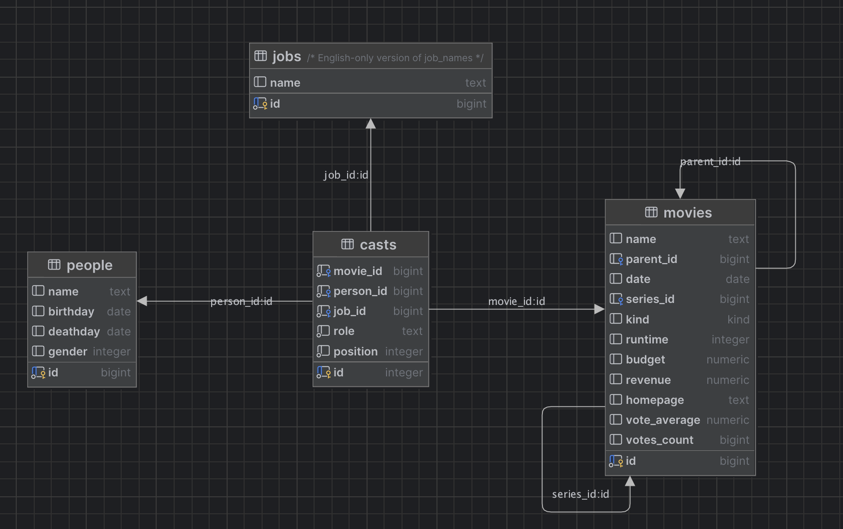

# Exercise 7 - Movie Details and Relationships

In this exercise, we'll create a movie detail page and use JPA annotations to model the relationships between movies, cast members, people, and jobs.

You will learn to:

- Look up a single entity by its id
- Use `@ManyToOne` and `@OneToMany` JPA annotations to model relationships
- Navigate relationships between entities

## 7.1 Link to movie details

:book: We want to be able to click on a movie in the list and display more details about that movie. There should be a separate page for movie details, and that page needs its own URL. The URL for the movies page is http://localhost:8080/movies, so it would be natural to use http://localhost:8080/movies/11 for a movie with id = 11.

:pencil2: Create a link to the details page for each movie in `movie-list.jsp`. Then, in `MoviesController.show()`, use the `id` parameter to look up the correct movie from the `MovieRepository` and pass it along to the `ModelAndView`.

<details>
<summary>:bulb: Hint</summary>

The syntax for linking to a page on the same host is `<a href="/movies/${movie.id}">${movie.name}</a>`
</details>

## 7.2 Show the cast of a movie

:book: There are lots of people involved in making a movie, and each person can be involved in several different movies, doing different jobs. This is represented by the `casts` table in the database, by connecting a person, a movie and a job.



When looking at one particular movie in the database, you can follow the relationship between the `movies` and the `casts` table to find all the people involved in that movie. This is a One-to-Many relationship, since one movie can have many casts, while one particular row in the `casts` table refers to only one movie. In JPA, this is described with the `@OneToMany` annotation.

:book: Example — a relationship between cars and their owners:

```java
@Entity
class Person {
  @Id
  Long id;

  @OneToMany(mappedBy = "owner") //refers to the java property name "owner" in the Car class
  List<Car> cars;
}

class Car {
  @Id
  Long id;

  @ManyToOne
  @JoinColumn("owner_person_id") //refers to the database column "owner_person_id" in the table "car"
  Person owner;
}
```

In this example, one `Person` can own many `Cars`, so this is a `@OneToMany` relationship as seen from the `Person` side. On the other hand, one `Car` can only have a single `Person` as its owner, so this is a `@ManyToOne` relationship.

:pencil2: Use the `@ManyToOne` and `@OneToMany` annotations to connect the `Movie` and `Cast` classes, the `Person` and `Cast` classes, and the `Job` and `Cast` classes. Try out the movie detail page and you should see the cast of the movie.

<details>
<summary>:bulb: Hint</summary>

In this database, the relationship between movie and casts is a one-to-many relationship. One movie is related to several casts. And inversely the relation between casts and movie is a many-to-one relation.

Casts also have a many-to-one relation to job and person.
</details>

## 7.3 Show the director

:book: You should now have a property `List<Cast> casts` in the `Movie` class. One of the cast members in that list has a `Job` with the name `"Director"`.

:pencil2: Implement the `getDirector()` method in `Movie` so that it returns the `Person` who was the director. Then, display the name of that person in the `movie-list.jsp` page in the "Director" column.

:pencil2: Now that you have the director of a movie, create a link to a page that shows more details about that person. The URL should be http://localhost:8080/directors/1 for a person with id=1.

### [Go to exercise 8 :arrow_right:](../exercise-8/README.md)
