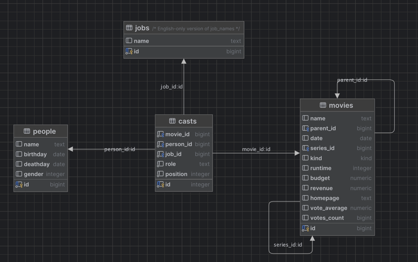

# Java Persistence API

To run the project: 

```shell
mvn clean spring-boot:run 
```

After you've made changes, you must restart the project. If you use IntelliJ, simply rebuilding the project 
(Build -> Build Project) will trigger an automatic reload. 

# Exercise 1 - List all the Star Wars movies

If you visit http://localhost:8080 you should see a list of movies released in may 1985. This list is generated
by the `MovieController` class, which in turn uses `MovieRepository` to query the database.

:pencil2: Change the method `MovieRepository.findMovies()` so that it returns all the Star Wars movies. You can use
the `LIKE` keyword and the `%` wildcard to match parts of a string.

# Exercise 2 - Link to homepage

In the `movies` table, you'll find a column called `homepage`, but there is no corresponding field in
the `Movie` java class.

:pencil2: Add a `homepage` field to the `Movie` java class and display a link to the homepage of the movie
in `movie-list.jsp`.

# Exercise 3 - Link to movie details

We want to be able to click on a movie in the list and display more details about that movie. There should be
a separate page for movie details, and that page needs its own URL. It is common practice to use the id (or
other unique property) of the database row to create a unique URL. The URL for the movies page is
http://localhost:8080/movies, so it would be natural to use http://lcoalhost:8080/movies/11 for a movie with
id = 11.

:pencil2: Create a link to the details page for each movie in `movie-list.jsp`. Then, in `MoviesController.show()`,
use the `id` parameter to look up the correct movie from the `MovieRepository` and pass it along to the
`ModelAndView`.

# Exercise 4 - Show the cast of a movie

There are lots of people involved in making a movie, and each person can be involved in several different movies,
doing different jobs. This is represented by the `casts` table in the database, by connecting a person, a movie and a
job.



When looking at one particular movie in the database, you can follow the relationship between the `movies` and the
`casts` table to find all the people involved in that movie. This is a One-to-Many relationship, since one movie
can have many casts, while one particular row in the `casts` table refers to only one movie. In JPA, this is described
with the `@OneToMany` annotation.

Example: A relationship between cars and their owners

```java

@Entity
class Person {
  @Id
  Long id;
  @OneToMany(mappedBy = "owner")
  List<Car> cars;
}

class Car {
  @Id
  Long id;
  @ManyToOne
  @JoinColumn("owner_person_id")
  Person owner;
}
```

In this example, one `Person` can own many `Cars`, so this is a `@OneToMany` relationship as seen from the `Person`
side of the relationship. On the other hand, one `Car` can only have a single `Person` as its owner, so this is a
`@ManyToOne` relationship.

:pencil2: Use the `@ManyToOne` and `@OneToMany` annotations to connect the `Movie` and `Cast` classes, the
`Person` and `Cast` classes and the `Job` and `Cast` classes. Try out the movie detail page and you should see the
cast of the movie.

# Exercise 4 - Show the director

You should now have a property `List<Cast> casts` in the `Movie` class. One of the cast in that list has a `Job`
with the name `"Director"`.

:pencil2: Implement the `getDirector()` method in `Movie` so that it returns the `Person` who was the director.
Then, display the name of that person in the `movies-list` page in the "Director" column.

# Excercise 5 - Show details about a director

Now that you have the director of a movie, you can create a link to a page that shows more details about that person.
The URL should be http://localhost:8080/directors/1 for a person with id=1.

:pencil2: Add a link to the detail page of a director on the `movies-list` page.

# Exercise 6 - Show a list of movies a person has directed

You can navigate the `casts` relationship the other way, too. In `Person` there is a method called
`getMoviesDirected()`.

:pencil2: Implement the `Person.getMoviesDirected()` method by iterating through person's `casts` list and returning a
list of movies where the person was the director. Then, display the list of movies on the director's detail page.

# Exercise 7 - Show a list of directors

You've tried iterating through a list of cast to find directors, but in order to find all directors in this
manner, you would have to iterate through all people (or all movies) and looking at all their cast. This is a
task better left to the database.

In the `PersonRespository`, there is a method called `findAllDirectors()`, which has as SQL query.

:pencil2: Modify this query so that it joins the `people`, `casts` and `jobs` tables and returns only
the people who have directed at least one movie. This is a long list, so be sure to add `limit 100` to 
avoid fetching a lot of rows!

